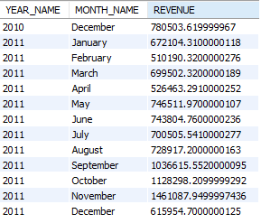
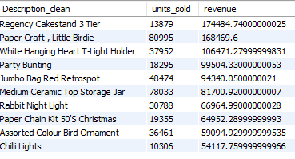
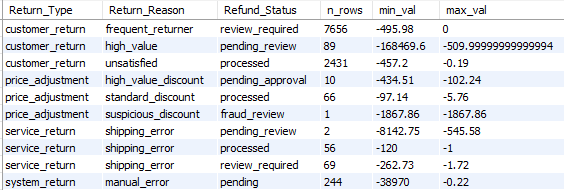
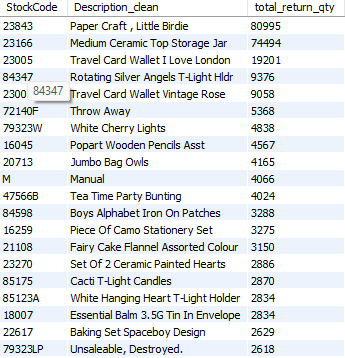
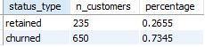

# 🛒 Retail Analytics & Returns Intelligence System
## End-to-End Python ETL + MySQL Data Analytics Project

## 📌 Overview
This project transforms messy raw retail transaction data into a fully cleaned, standardized, and analytics-ready dataset.  
It builds an intelligent SQL classification system for sales and returns, and produces deep analytics across:

- Sales performance

- Product intelligence 

- Return behavior detection

- RFM segmentation

- Cohort retention  

This system demonstrates strong capabilities in Python ETL, SQL modeling, BI analytics, and business storytelling.

## 🎯 Objective
The project aims to build a complete analytics ecosystem that:

- Cleans and standardizes raw retail data

- Recovers missing CustomerIDs

- Normalizes and consolidates product descriptions with fuzzy matching

- Classifies sales and returns into meaningful business groups

- Identifies fraudulent, damaged, or abnormal returns

- Generates sales trends, customer metrics, return intelligence, and retention models

## 🔧 What I Did (Methodology)

## 1️⃣ Python ETL Pipeline (etl.py)
The ETL pipeline (`python_pipeline/etl.py`) performs:

###  Data Loading  
- Reads CSV dataset  
- Parses dates and handles encoding

### CustomerID Recovery  
- Infers CustomerID from other rows within the same invoice  
- Tags customers as **Registered** or **Guest**

### Product Description Cleaning  
- Normalizes text (lowercase, remove noise, collapse whitespace)  
- Uses **fuzzy matching** to cluster similar descriptions  
- Creates a single canonical product name: `Description_clean`

### Derived Features  
- `Order_Value = Quantity × UnitPrice`  
- Customer type labels

### Write to MySQL  
- Writes the cleaned dataset (`clean_transactions`) in **chunks** to avoid connection drops.

📁 **Output table:** `clean_transactions`

## 📊 2️⃣ SQL Classification Models

### **A. Sales Classification**
Sales are categorized into:

| Category | Meaning |
|---------|---------|
| **product** | regular product sale |
| **service** | postage, shipping, Amazon fees |
| **adjustment** | manual corrections, free samples |
| **product_type** | regular / accessory / shipping / sample |
| **financial_type** | revenue / non-revenue / fee |

This provides business meaning to raw sales rows.

📁 **Output view:** `sales_classified`

### **B. Returns Classification**
A custom rule-based SQL engine categorizes returns by:

#### **Return_Type**
- cancellation  
- customer_return  
- price_adjustment  
- damaged_goods  
- service_return  
- system_return  

#### **Return_Reason**
- defective_product  
- shipping_error  
- suspicious_discount  
- frequent_returner  
- high_value  

#### **Refund_Status**
- processed  
- pending  
- pending_review  
- fraud_review  
- review_required  

📁 **Output view:** `returns_classified`

This allows detection of abnormal or fraud-like return behavior.

---

## 📈 3️⃣ Analytical Modules

---

### 📌 **A. Sales Analytics**
Includes:

- Monthly revenue trends  
- Top 10 revenue-generating products  
- Revenue by country  
- Product-level return rates
  
**Monthly Revenue Trend**
  

**TOP_PRODUCTS_BY_REVENUE**

 
### 📌 **B. Returns Analytics**
Insights include:

- Total return quantity & value  
- Most returned products  
- Return type summary  
- Return reason × refund status matrix  

**RETURN_TYPE_SUMMARY**

**TOP_RETURNED_PRODUCTS**

### 📌 **C. Customer Analytics**
Includes:

#### 1️⃣ Customer Lifetime Value (LTV)
Shows total revenue, returns, and net value per customer.

#### 2️⃣ Repeat Purchase Behavior
Shows repeat customer ratio.

#### 3️⃣ Retention vs Churn
| Status | Meaning |
|--------|---------|
| **retained** | purchased in first & last month |
| **churned** | purchased in first month but not last |

#### 4️⃣ Customer Profitability by Country

#### 5️⃣ Monthly Active Customers

**MONTHLY_ACTIVE_CUSTOMERS** 

  
**RETENTION_VS_CHURN**

---

### 📌 **D. RFM Segmentation**
Customers segmented using:

- **Recency**
- **Frequency**
- **Monetary**

RFM scoring assigns each user a segment:

- Champion  
- Loyal  
- Big Spender  
- Potential Loyalist  
- At Risk  
- Churn Risk  
- Other  

#### Sample Output  
| Segment | Count | % |
|--------|-------|----|
| Other | 2241 | 51.65% |
| At Risk | 1107 | 25.51% |
| Loyal | 255 | 5.88% |
| Big Spender | 235 | 5.42% |
| Champion | 203 | 4.68% |
| Potential Loyalist | 149 | 3.43% |
| Churn Risk | 149 | 3.43% |

#### 📷 Recommended image:
9. **rfm_segment_distribution.png**

---

### 📌 **E. Cohort Retention**
Tracks customer retention month by month.

Example retention summary:

| Metric | Value |
|--------|--------|
| Month 1 retention | 20.50% |
| Month 2 retention | 22.01% |
| Month 3 retention | 23.22% |
| Month 6 retention | 24.37% |
| Month 12 retention | 26.55% |

### 📷 Recommended image:
10. **cohort_retention_summary.png**

---

